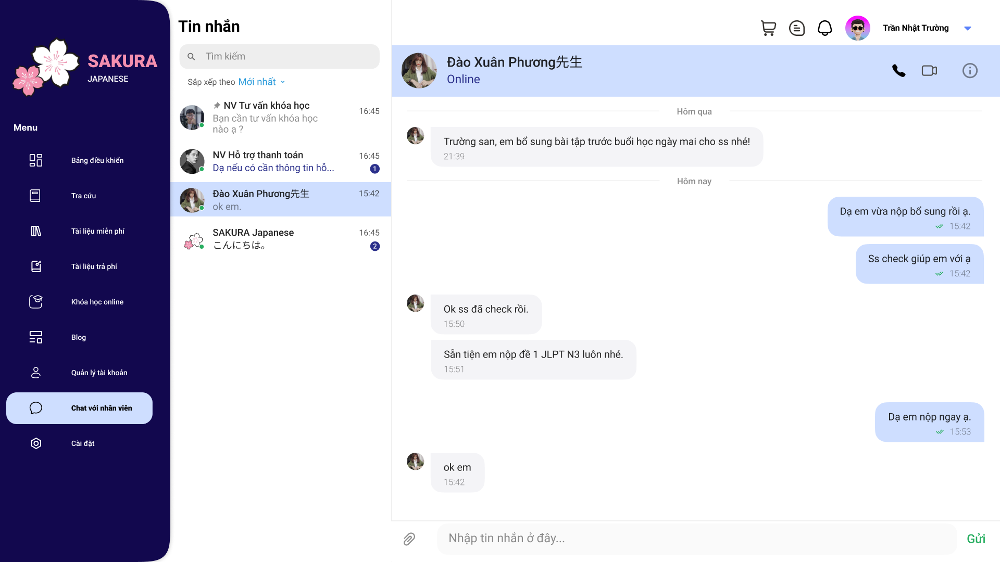
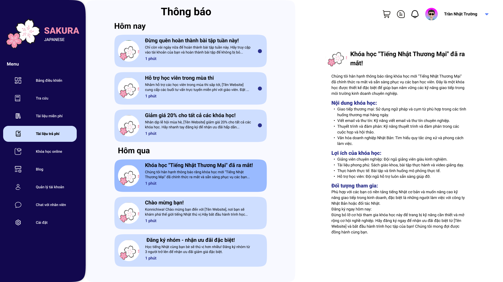

# Sakura Japanese

## Mô tả

Sakura Japanese là một website học tiếng Nhật được thiết kế để giúp người học tiếp cận và nâng cao trình độ tiếng Nhật của mình một cách hiệu quả và thú vị. Dự án này được thiết kế bằng Figma với giao diện người dùng đẹp mắt và thân thiện, nhấn mạnh vào trải nghiệm người dùng.

## Lí do phát triển

Trong bối cảnh toàn cầu hóa ngày càng phát triển, việc học ngoại ngữ không chỉ là một lợi thế cá nhân mà còn là một yêu cầu cần thiết để cạnh tranh và thành công trong môi trường làm việc hiện đại. Trong số các ngôn ngữ được người học quan tâm, tiếng Nhật nổi bật với vị trí đặc biệt, không chỉ là ngôn ngữ của một quốc gia phát triển mạnh mà còn là ngôn ngữ của văn hóa đa dạng, nền kinh tế mạnh mẽ và công nghệ tiên tiến.

Để đáp ứng nhu cầu ngày càng tăng của người học tiếng Nhật, việc sử dụng các nền tảng trực tuyến để học ngôn ngữ đã trở thành một xu hướng không thể phủ nhận. Tuy nhiên, sự thành công của một nền tảng học trực tuyến phụ thuộc không chỉ vào chất lượng nội dung mà còn vào trải nghiệm người dùng thông qua giao diện. Tuy nhiên đến thời điểm hiện tại, việc tìm ra một website học tiếng Nhật có giao diện trực quan, đẹp mắt là một điều rất khó. 

Nhận thức rõ ràng về tầm quan trọng của việc tạo ra một giao diện trực quan, thân thiện và hiệu quả cho một website học tiếng Nhật, tôi đã tập trung vào việc nghiên cứu, phân tích để hiểu rõ nhu cầu của người dùng, từ đó đề xuất các giải pháp thiết kế giao diện hợp lý, đặt mục tiêu tạo ra một giao diện mang lại trải nghiệm học tập đáng nhớ, khuyến khích sự tương tác và nâng cao hiệu suất học tập.

## Hình ảnh giao diện

Dưới đây là một số hình ảnh giao diện của Sakura Japanese được thiết kế bằng Figma:

### Trang chủ

### Trang đăng nhập

### Dashboard

### Trang tra cứu từ vựng

### Trang tài liệu học tập

### Trang bài học

### Trang khóa học online

### Trang thanh toán

### Trang lịch học

### Trang chat

### Trang thông báo

## Tính năng chính

- **Giao diện người dùng hiện đại**: Thiết kế đơn giản, trực quan và thân thiện với người dùng, giúp dễ dàng truy cập và sử dụng.
- **Khóa học đa dạng**: Cung cấp các bài học từ cơ bản đến nâng cao, phù hợp với mọi trình độ.
- **Bài tập và kiểm tra**: Các bài tập và kiểm tra giúp người học củng cố kiến thức và đánh giá trình độ của mình.
- **Từ điển và tài liệu học tập**: Tích hợp từ điển tiếng Nhật và các tài liệu học tập hữu ích.

## Công nghệ sử dụng

- **Thiết kế giao diện**: Figma.
- **Frontend (dự kiến)**: HTML, CSS, JavaScript.
- **Backend (dự kiến)**: Node.js, Express.js hoặc Django.
- **Cơ sở dữ liệu (dự kiến)**: MySQL, MongoDB.

## Cài đặt và sử dụng

Hiện tại, dự án chỉ bao gồm phần thiết kế giao diện bằng Figma. Các bước triển khai sẽ được cập nhật sau khi phát triển hoàn thành.

### Cách mở web demo
1. Truy cập [Link demo](https://www.figma.com/proto/2veztJ7bWh1YxoK4zm9iwx/Nh%C3%B3m-2---%C4%90%E1%BB%93-%C3%A1n-IE106?page-id=0%3A1&node-id=2869-45681&viewport=-9873%2C-13811%2C0.28&t=1sC87wp83ULnDklq-1&scaling=scale-down-width&starting-point-node-id=2137%3A20840&content-scaling=fixed&show-proto-sidebar=1).
2. Chọn chế độ "Fit width" và xem ở chế độ "Full screen".
3. Bắt đầu tương tác với giao diện. Prototyping của Sakura Japanese được thiết kế vô cùng đầy đủ và chi tiết, không khác gì một website thật.

## Đóng góp

Tôi hoan nghênh mọi đóng góp để hoàn thiện dự án này. Nếu bạn có ý tưởng hoặc muốn tham gia phát triển, vui lòng fork repository và gửi pull request. Bạn cũng có thể mở issues để báo cáo lỗi hoặc đề xuất tính năng mới.

## Liên hệ

Nếu có bất kỳ câu hỏi hoặc phản hồi nào, vui lòng liên hệ qua email: ntruong0961@gmail.com.

---

Tôi hy vọng Sakura Japanese sẽ là một công cụ hữu ích cho bạn trên con đường học tiếng Nhật. Cảm ơn bạn đã quan tâm và ủng hộ dự án!
