## 🌸 Sakura Japanese

### 説明

桜日本語は、日本語学習者が効果的かつ楽しく日本語のスキルを向上させるために設計されたウェブサイトです。このプロジェクトは、美しくユーザーフレンドリーなインターフェースを持つFigmaで設計されており、ユーザーエクスペリエンスを重視しています。

### 開発理由

グローバル化が進む中、外国語を学ぶことは個人的な利点であるだけでなく、現代の職場環境で競争し、成功するための必須要件でもあります。学習者に人気のある言語の中で、日本語は特別な位置を占めており、発展した国の言語であるだけでなく、多様な文化、強力な経済、先進技術の言語でもあります。

増加する日本語学習者の需要に応えるために、オンラインプラットフォームを使用して言語を学ぶことが否定できないトレンドになっています。しかし、オンライン学習プラットフォームの成功は、コンテンツの質だけでなく、インターフェースを通じたユーザーエクスペリエンスにも依存します。現在のところ、直感的で美しいインターフェースを持つ日本語学習ウェブサイトを見つけることは非常に困難です。

直感的でフレンドリーかつ効果的なインターフェースを持つ日本語学習ウェブサイトを作成する重要性を認識し、ユーザーのニーズを理解するために研究と分析に集中し、合理的なインターフェースデザインソリューションを提案しました。これにより、記憶に残る学習体験を提供し、インタラクションを促進し、学習効率を向上させるインターフェースを目指しています。

### インターフェースの画像

以下はFigmaで設計された桜日本語のインターフェースの一部です：

#### ホームページ

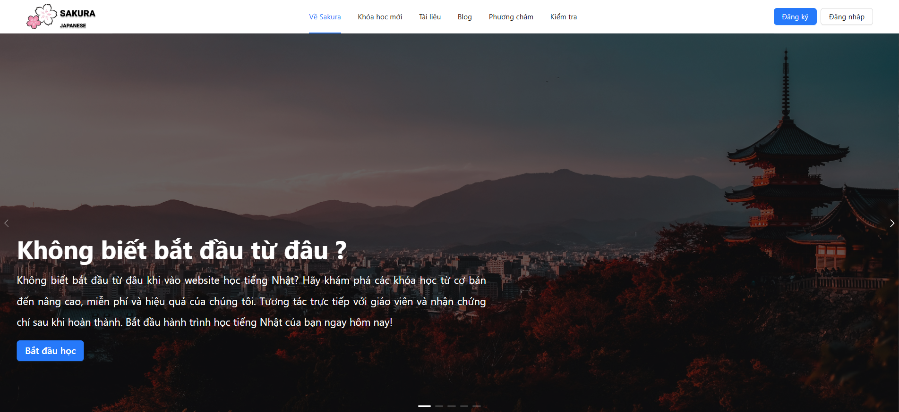
.png)
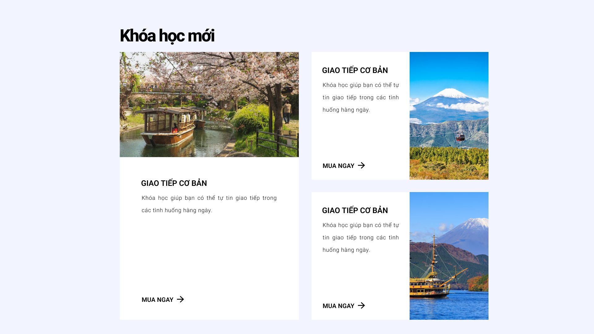
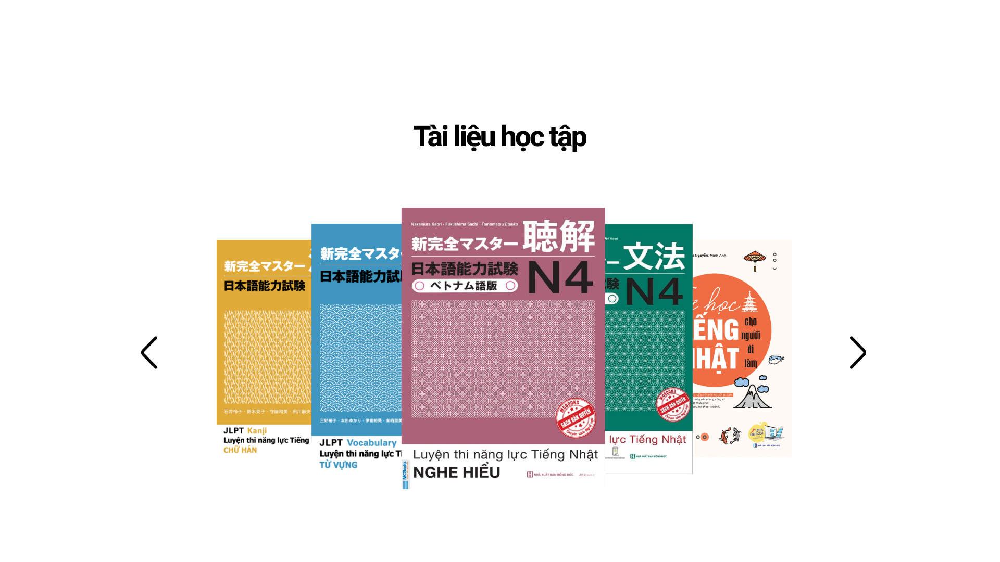
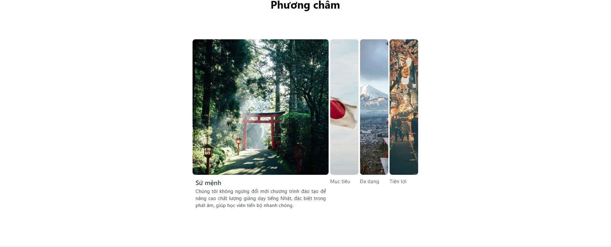
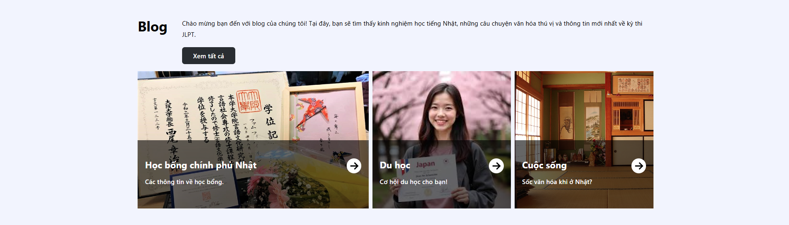

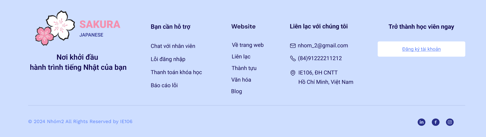

#### ログインページ

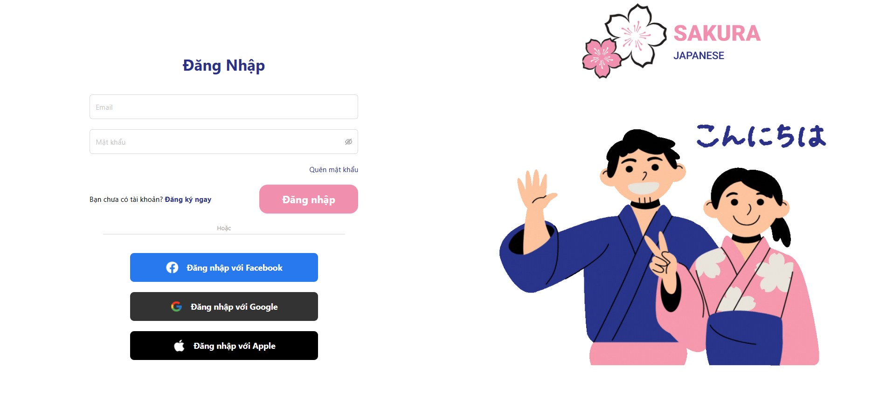

#### ダッシュボード
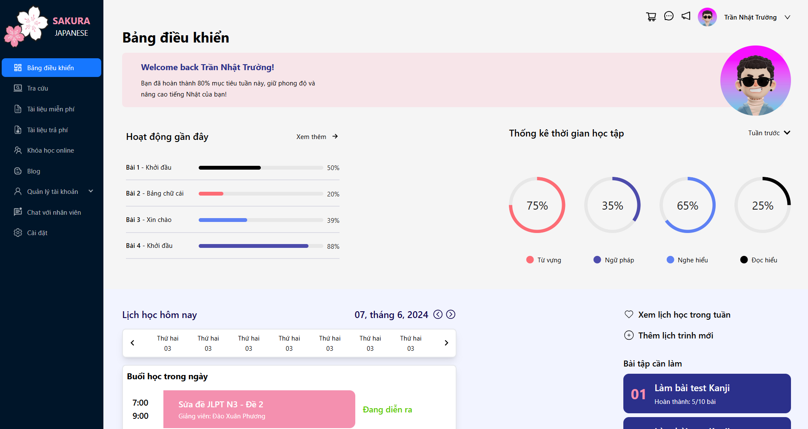

#### 語彙検索ページ

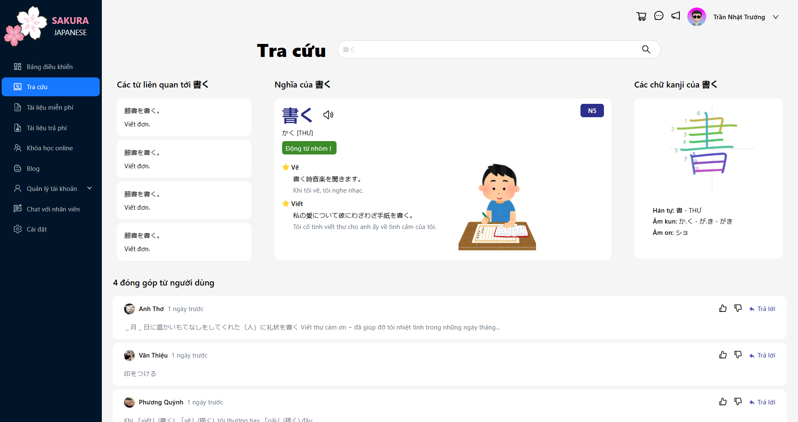

#### 学習資料ページ

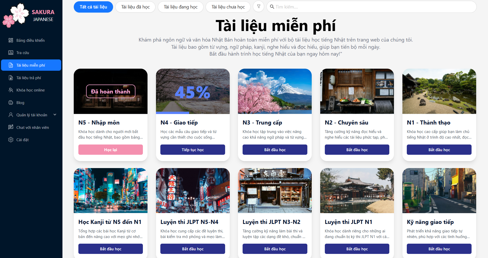

#### レッスンページ

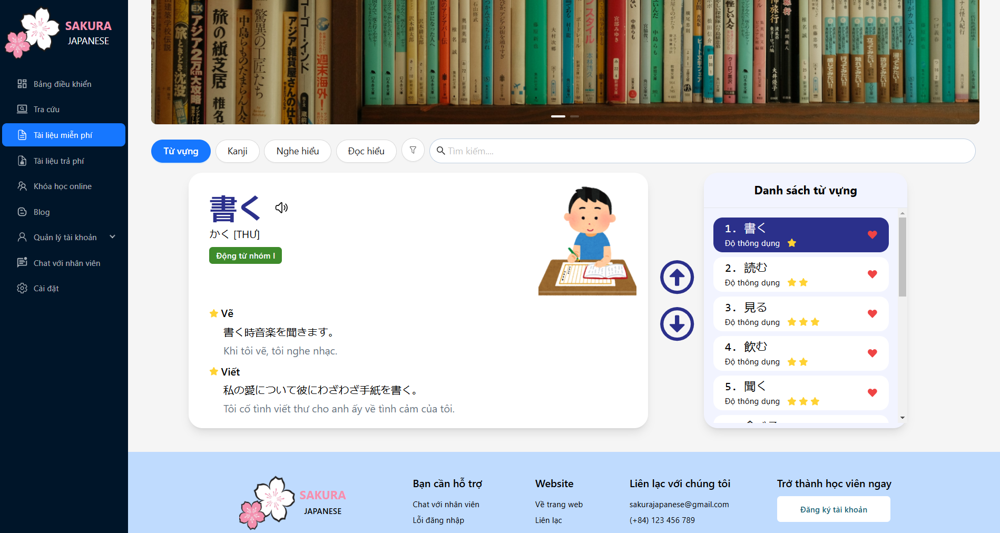

#### オンラインコースページ

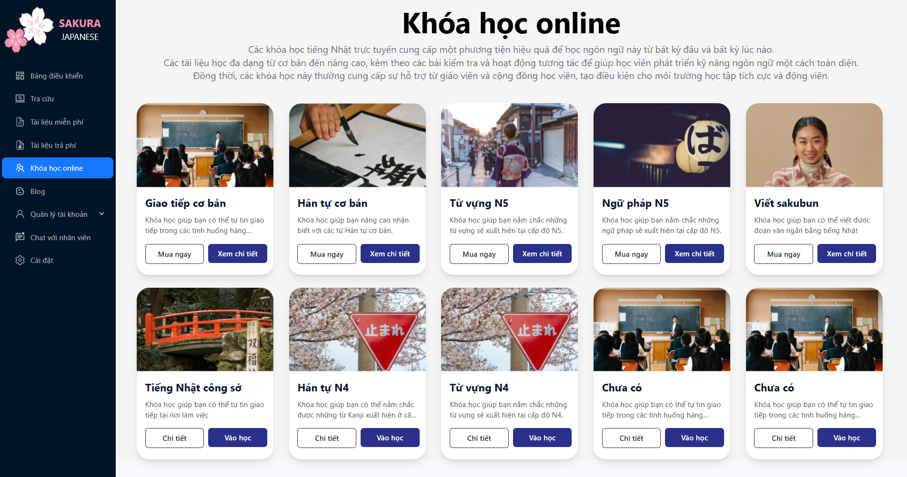

#### 支払いページ

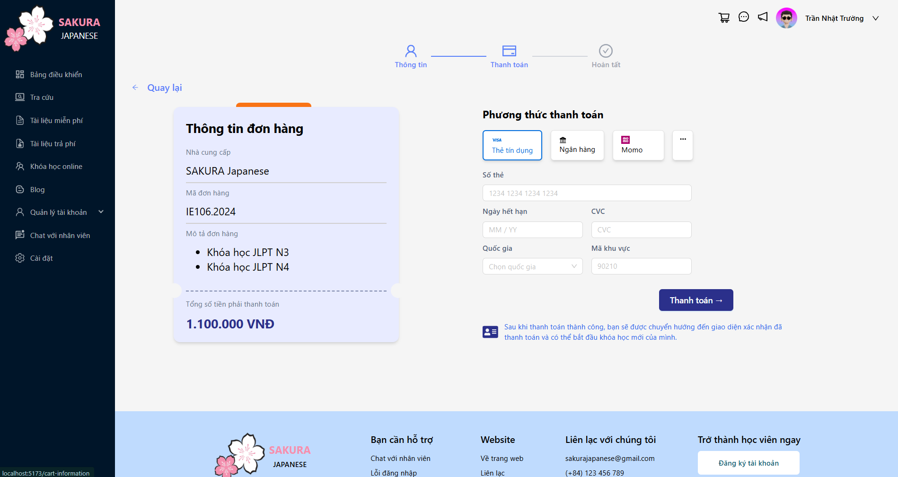

#### スケジュールページ

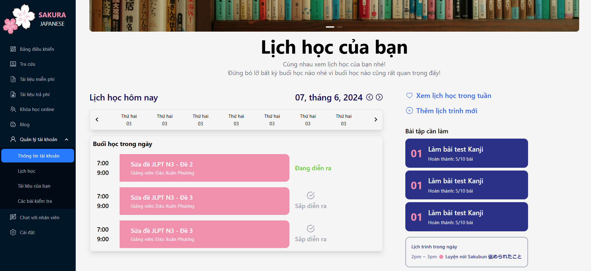
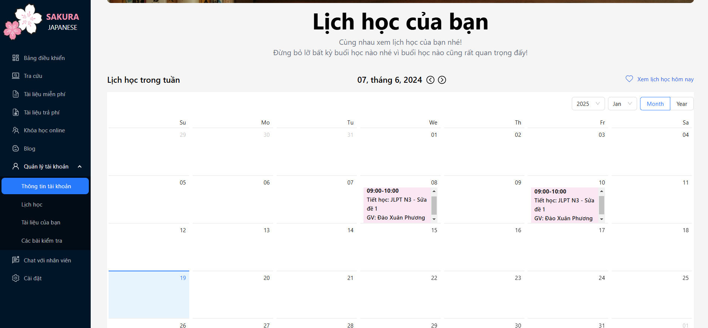

#### チャットページ
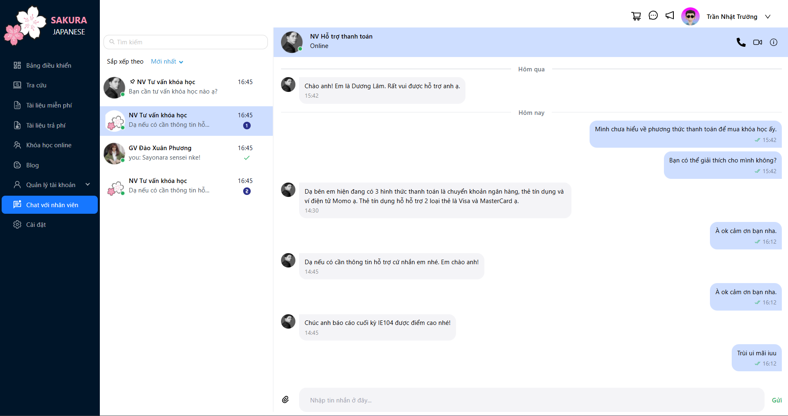

### 主な機能

- **モダンなユーザーインターフェース**: シンプルで直感的なデザイン、ユーザーフレンドリーでアクセスしやすい。
- **多様なコース**: 初級から上級までのレッスンを提供し、すべてのレベルに対応。
- **エクササイズとテスト**: 知識を強化し、レベルを評価するためのエクササイズとテスト。
- **辞書と学習資料**: 日本語辞書と役立つ学習資料を統合。

### 使用技術

- **インターフェースデザイン**: Figma。
- **フロントエンド**: React、TailWind CSS。
- **バックエンド（予定）**: Node.js、MongoDB。

### インストールと使用方法

現在、プロジェクトはフロントエンド部分が完成しています。ローカルでクローンして実行するか、[デモビデオを見る](https://drive.google.com/file/d/1oiX1sKLQv3LhdEq4Wjf6TI1t6jsgqU01/view?usp=sharing)。

#### デモウェブを開く方法
1.「npm install」コマンドを実行
2.「npm run dev」コマンドを実行
3. インターフェースを自分で探索し始めてください。

### 貢献

このプロジェクトを改善するための貢献を歓迎します。アイデアがある場合や開発に参加したい場合は、リポジトリをフォークしてプルリクエストを送信してください。また、バグを報告したり新機能を提案したりするためにissuesを開くこともできます。

### 連絡先

質問やフィードバックがある場合は、メールでお問い合わせください：ntruong0961@gmail.com。

---

桜日本語があなたの日本語学習の旅に役立つツールとなることを願っています。プロジェクトに関心を持っていただき、ありがとうございます！

# 🌸 Sakura Japanese

## Mô tả

Sakura Japanese là một website học tiếng Nhật được thiết kế để giúp người học tiếp cận và nâng cao trình độ tiếng Nhật của mình một cách hiệu quả và thú vị. Dự án này được thiết kế bằng Figma với giao diện người dùng đẹp mắt và thân thiện, nhấn mạnh vào trải nghiệm người dùng.

## Lí do phát triển

Trong bối cảnh toàn cầu hóa ngày càng phát triển, việc học ngoại ngữ không chỉ là một lợi thế cá nhân mà còn là một yêu cầu cần thiết để cạnh tranh và thành công trong môi trường làm việc hiện đại. Trong số các ngôn ngữ được người học quan tâm, tiếng Nhật nổi bật với vị trí đặc biệt, không chỉ là ngôn ngữ của một quốc gia phát triển mạnh mà còn là ngôn ngữ của văn hóa đa dạng, nền kinh tế mạnh mẽ và công nghệ tiên tiến.

Để đáp ứng nhu cầu ngày càng tăng của người học tiếng Nhật, việc sử dụng các nền tảng trực tuyến để học ngôn ngữ đã trở thành một xu hướng không thể phủ nhận. Tuy nhiên, sự thành công của một nền tảng học trực tuyến phụ thuộc không chỉ vào chất lượng nội dung mà còn vào trải nghiệm người dùng thông qua giao diện. Tuy nhiên đến thời điểm hiện tại, việc tìm ra một website học tiếng Nhật có giao diện trực quan, đẹp mắt là một điều rất khó. 

Nhận thức rõ ràng về tầm quan trọng của việc tạo ra một giao diện trực quan, thân thiện và hiệu quả cho một website học tiếng Nhật, chúng tôi đã tập trung vào việc nghiên cứu, phân tích để hiểu rõ nhu cầu của người dùng, từ đó đề xuất các giải pháp thiết kế giao diện hợp lý, đặt mục tiêu tạo ra một giao diện mang lại trải nghiệm học tập đáng nhớ, khuyến khích sự tương tác và nâng cao hiệu suất học tập.

## Hình ảnh giao diện

Dưới đây là một số hình ảnh giao diện của Sakura Japanese được thiết kế bằng Figma:

### Trang chủ

.png)

### Trang đăng nhập

### Dashboard

### Trang tra cứu từ vựng

### Trang tài liệu học tập

### Trang bài học

### Trang khóa học online

### Trang thanh toán

### Trang lịch học

### Trang chat

## Tính năng chính

- **Giao diện người dùng hiện đại**: Thiết kế đơn giản, trực quan và thân thiện với người dùng, giúp dễ dàng truy cập và sử dụng.
- **Khóa học đa dạng**: Cung cấp các bài học từ cơ bản đến nâng cao, phù hợp với mọi trình độ.
- **Bài tập và kiểm tra**: Các bài tập và kiểm tra giúp người học củng cố kiến thức và đánh giá trình độ của mình.
- **Từ điển và tài liệu học tập**: Tích hợp từ điển tiếng Nhật và các tài liệu học tập hữu ích.

## Công nghệ sử dụng

- **Thiết kế giao diện**: Figma.
- **Frontend**: React、TailWind CSS.
- **Backend (dự kiến)**: Node.js, MongoDB.

## Cài đặt và sử dụng

Hiện tại, dự án đã hoàn thành xong phần fontend, bạn có thể clone về rồi chạy local hoặc [Xem video demo](https://drive.google.com/file/d/1oiX1sKLQv3LhdEq4Wjf6TI1t6jsgqU01/view?usp=sharing).

### Cách chạy
1. Chạy câu lệnh "npm install"
2. Chạy câu lệnh "npm run dev"
3. Bắt đầu tự khám phá giao diện.

## Đóng góp

Tôi hoan nghênh mọi đóng góp để hoàn thiện dự án này. Nếu bạn có ý tưởng hoặc muốn tham gia phát triển, vui lòng fork repository và gửi pull request. Bạn cũng có thể mở issues để báo cáo lỗi hoặc đề xuất tính năng mới.

## Liên hệ

Nếu có bất kỳ câu hỏi hoặc phản hồi nào, vui lòng liên hệ qua email: ntruong0961@gmail.com.

---

Tôi hy vọng Sakura Japanese sẽ là một công cụ hữu ích cho bạn trên con đường học tiếng Nhật. Cảm ơn bạn đã quan tâm và ủng hộ dự án!
